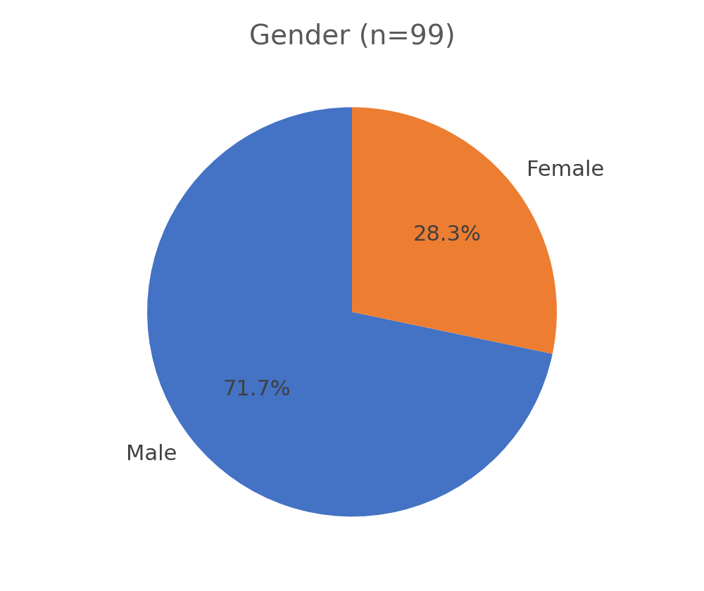
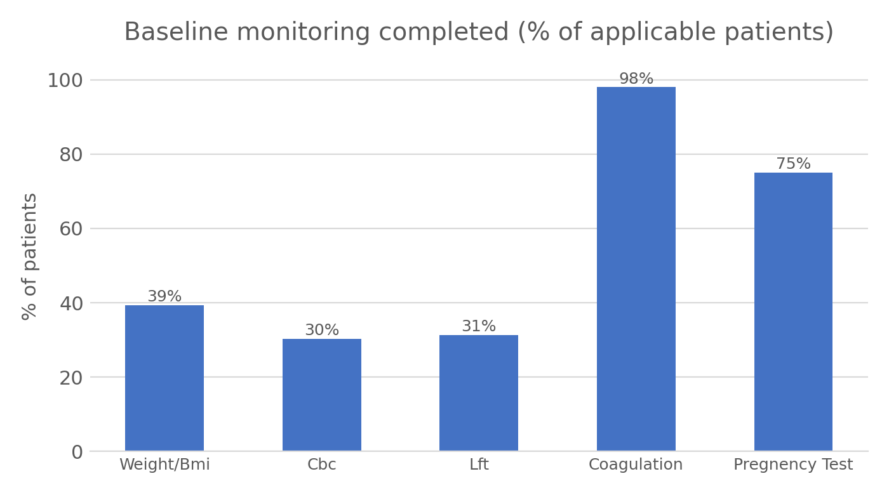
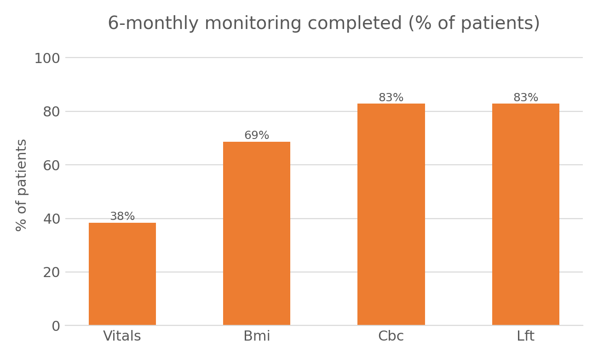
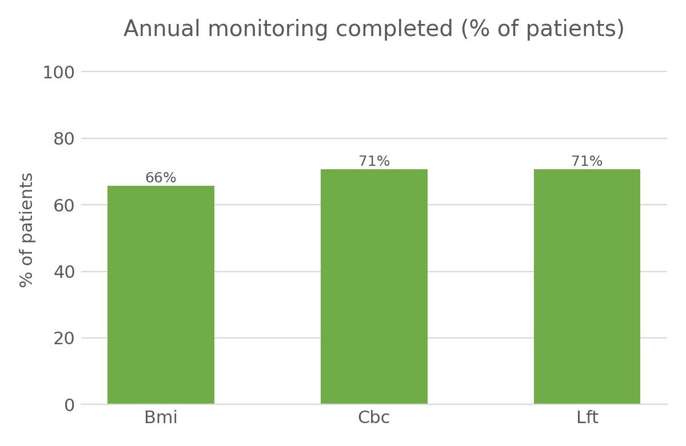
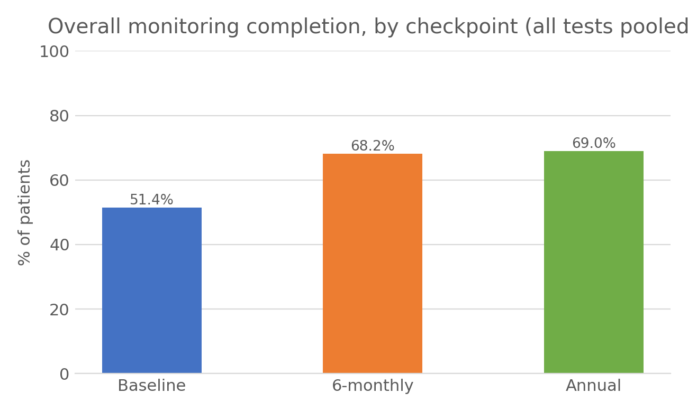

# Clinical Monitoring Audit: Compliance with Physical and Laboratory Monitoring Guidelines

> How well did clinical practice follow recommended physical and laboratory monitoring at baseline, 6 months and annually? A retrospective audit of 99 patients.

## Background
Certain treatments require regular physical and laboratory monitoring (for example weight/BMI, blood counts, liver function, coagulation, and pregnancy testing where relevant) to catch adverse effects early. This audit checks how consistently that monitoring was completed against the recommended schedule, at three checkpoints: baseline, 6-monthly, and annually.

## Data
- **99 patients** (71.7% male, 28.3% female), audited retrospectively from clinical records.
- Baseline monitoring: weight/BMI, CBC, LFT, coagulation, and pregnancy test (28 female patients of relevant age).
- 6-monthly monitoring: vitals, BMI, CBC, LFT.
- Annual monitoring: BMI, CBC, LFT.
- Each item recorded as done / not done.
- The patient-level data is **not included** in this repository because it contains medical record numbers (MRNs).

## Methodology
Descriptive audit: for each checkpoint, the percentage of patients with each monitoring item completed was calculated against the total number of patients for whom that item applied.

## Results



### Baseline monitoring


Coagulation testing was almost universal (98%), and the pregnancy test was completed for 75% of the 28 patients it applied to. Weight/BMI, CBC and LFT were completed for only 30-39% of patients at baseline.

### 6-monthly monitoring


CBC and LFT compliance rose sharply to 83% at the 6-month check. Vitals were the weakest item (38%), and BMI reached 69%.

### Annual monitoring


BMI, CBC and LFT compliance stabilised around 66-71% at the annual check.

### Overall trend


Pooling all monitoring items at each checkpoint, overall completion rose from 51.4% at baseline to 68.2% at 6 months and 69.0% at the annual check — baseline monitoring was the weakest point in the pathway.

## Limitations
- The source report does not name the treatment or clinical guideline this monitoring schedule is based on; the audit is described here in general terms.
- Retrospective audit based on documentation in patient records, so "not done" may include monitoring that was done but not recorded.
- No comparison group or statistical testing; results are descriptive percentages only.
- Some items (e.g. pregnancy test) applied only to a subset of patients, so denominators differ across items and are not directly comparable.

## Repository structure
```
├── README.md
├── Monitoring_audit_report.pdf   # full audit report
└── images/                       # charts used in this README
```

## Tools
- Microsoft Excel
- Microsoft Word
